# Debugger UI Architecture

Deep analysis of how the Quaesar debugger UI works: component hierarchy, widget inventory, emulator binding mechanism, data flow, and operation dispatch.

---

## 1. Component Hierarchy

The debugger UI lives in its **own OS window** (separate from the emulator display) and is built on a layered architecture:

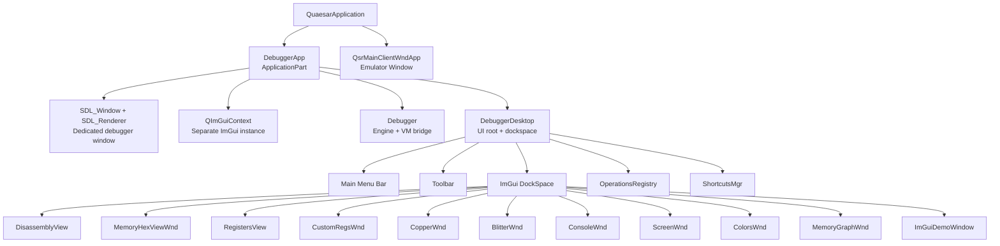

**Source files for the hierarchy:**

| Component | Header | Implementation |
|-----------|--------|----------------|
| DebuggerApp | `libs/amDebugger/src/amDebugger/debuggerWndApp.h` | `debuggerWndApp.cpp` |
| Debugger (engine) | `libs/amDebugger/src/amDebugger/debugger.h` | `debugger.cpp` |
| DebuggerDesktop | `libs/amDebugger/src/amDebugger/ui/debuggerDesktop.h` | `ui/debuggerDesktop.cpp` |
| AmDbgWindow (base) | `libs/amDebugger/src/amDebugger/ui/uiView.h` | `ui/uiView.cpp` |
| VM abstraction | `libs/amDebugger/src/amDebugger/vm/vmInterface.h` | `vm/vmInterface.cpp` |
| Connection bridge | `libs/amDebugger/src/amDebugger/dbgConnection.h` | `dbgConnection.cpp` |

---

## 2. Lifecycle and Initialization Sequence

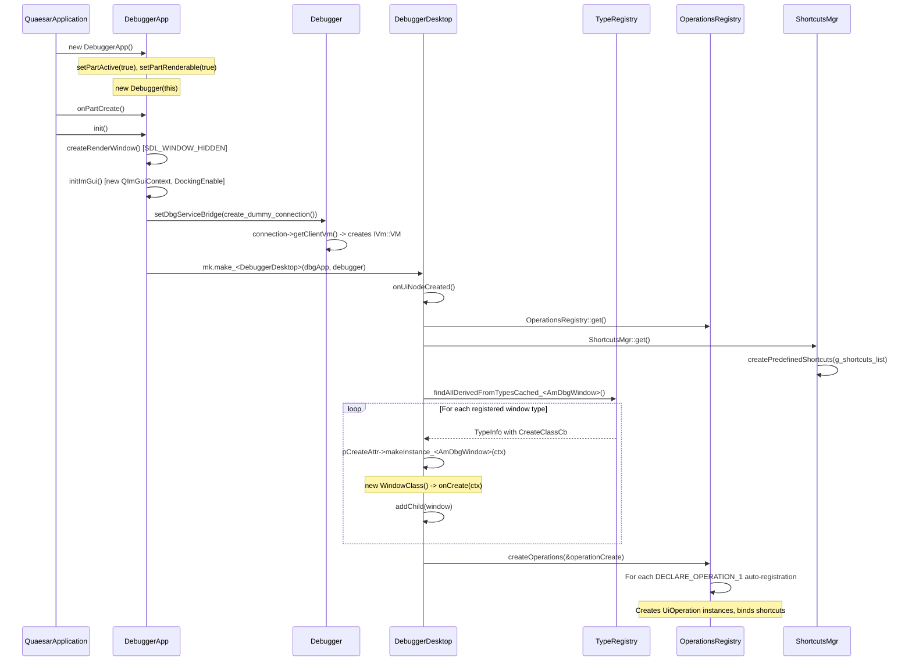

**Key source:** [debuggerWndApp.cpp](file:///Volumes/TB4-4Tb/Projects/emulators/github/quaesar-ng/libs/amDebugger/src/amDebugger/debuggerWndApp.cpp) lines 42-55, [debuggerDesktop.cpp](file:///Volumes/TB4-4Tb/Projects/emulators/github/quaesar-ng/libs/amDebugger/src/amDebugger/ui/debuggerDesktop.cpp) lines 113-129.

---

## 3. Per-Frame Rendering Loop

Every frame, `DebuggerApp::updateAppPart()` drives the entire render pipeline:

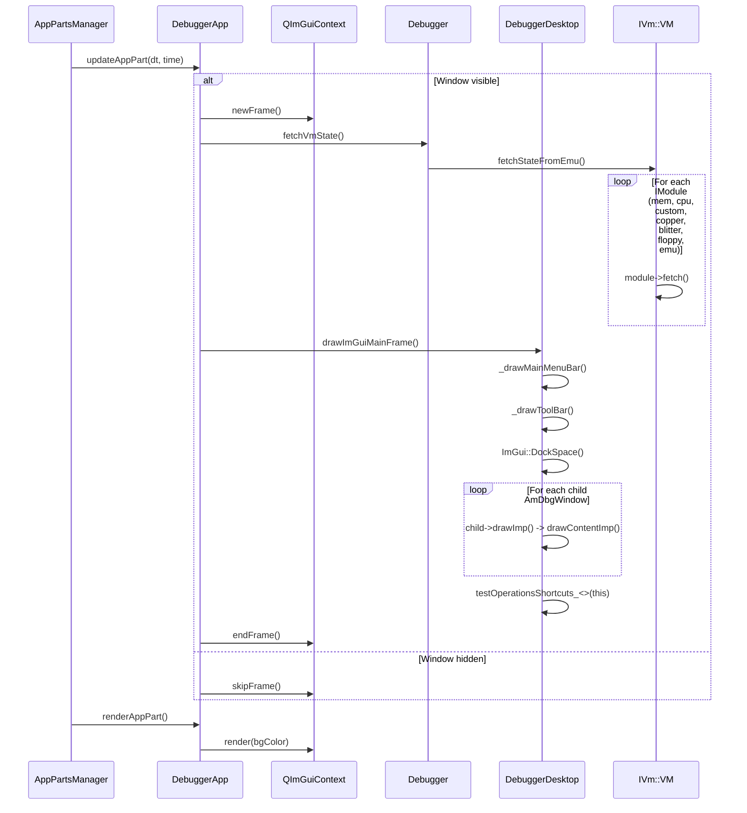

**Source:** [debuggerWndApp.cpp](file:///Volumes/TB4-4Tb/Projects/emulators/github/quaesar-ng/libs/amDebugger/src/amDebugger/debuggerWndApp.cpp) lines 132-150.

---


## 4. Emulator Binding: The VM Connection Bridge

The debugger never touches emulator internals directly. Instead, it goes through a layered bridge:

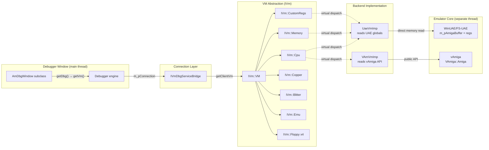

### Connection Types

| Connection Class | File | Description |
|------------------|------|-------------|
| `DummyVmDbgServiceBridge` | `libs/amDebugger/src/amDebugger/dbgConnection.cpp:9-23` | Creates a standalone `IVm::VM` with default-constructed modules. Used during initial setup before any emulator is active. Client and server VMs are the same object. |
| `UaeSharedConnectionImpl` | `src/quasar_app/uae_imp/uae_server_app_part.cpp:21-35` | Wraps the UAE-backed `UaeVmImp` instance. Shared: same VM object for both client (debugger reads) and server (debugger writes). Direct pointer to UAE globals. |

### Binding Sequence

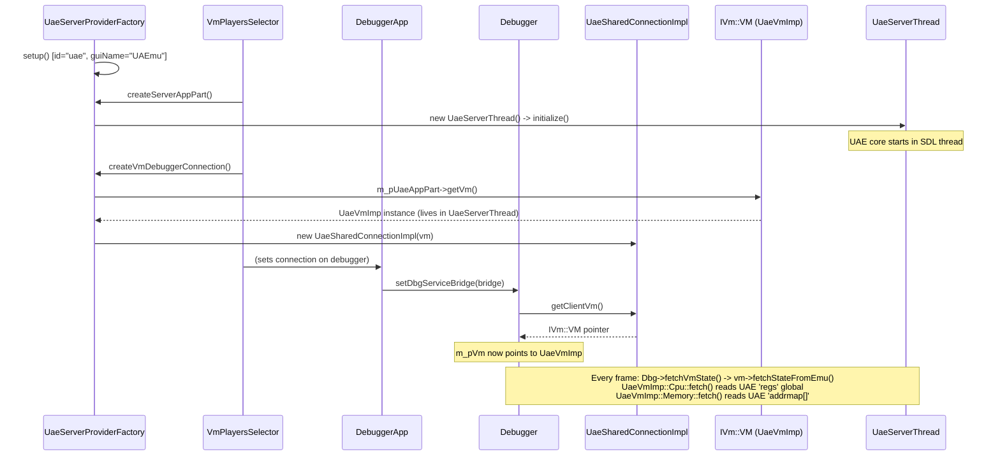

**Source:** [uae_server_app_part.cpp](file:///Volumes/TB4-4Tb/Projects/emulators/github/quaesar-ng/src/quasar_app/uae_imp/uae_server_app_part.cpp) lines 56-77, [dbgConnection.cpp](file:///Volumes/TB4-4Tb/Projects/emulators/github/quaesar-ng/libs/amDebugger/src/amDebugger/dbgConnection.cpp) lines 9-29.

---

## 5. Window Widget Inventory

All debugger windows inherit from `AmDbgWindow` (which inherits `qd::UiWindow` + `IOperationEnvironment`). Windows are auto-discovered at startup via the type reflection system.

### Window Registration Mechanism

Each window uses the `QDB_WINDOW_REGISTER` macro:

```cpp
// In disassembly_wnd.h:
class DisassemblyView : public amD::AmDbgWindow {
    QDB_WINDOW_REGISTER(WndId::Disassembly, amD::window::DisassemblyView, amD::AmDbgWindow);
    // ...
};
```

This expands to:
1. `TS_BEGIN_REFLECT_CLASS` -- registers the type with `TypeRegistry`
2. `TS_ATTRIBUTE(CustomClassId32(WndId::Disassembly))` -- binds enum ID
3. `TS_ATTRIBUTE(CreateClassCb(&createWindowCb_<DisassemblyView>))` -- registers factory function

At startup, `DebuggerDesktop::createAllUiWndows()` queries `TypeRegistry::findAllDerivedFromTypesCached_<AmDbgWindow>()`, iterates all registered types, calls the factory for each, and adds the resulting window as a child.

**Source:** [uiView.h](file:///Volumes/TB4-4Tb/Projects/emulators/github/quaesar-ng/libs/amDebugger/src/amDebugger/ui/uiView.h) lines 73-88, [debuggerDesktop.cpp](file:///Volumes/TB4-4Tb/Projects/emulators/github/quaesar-ng/libs/amDebugger/src/amDebugger/ui/debuggerDesktop.cpp) lines 132-150.

### Complete Window Catalog

| WndId | Class | Header | Impl | UI Widgets | VM Data Read | VM Data Written |
|-------|-------|--------|------|------------|-------------|-----------------|
| `Disassembly` | `DisassemblyView` | `window/disassembly_wnd.h` | 239 lines | InputText (address expr), Button (PC), 4-column Table (breakpoint dot, addr hex, opcode bytes, mnemonic), mouse wheel scroll | `cpu->getPC()`, `memory->getU16/U32()` via Capstone | Breakpoints via `DisasmToggleBreakpoint` op |
| `MemoryView` | `MemoryHexViewWnd` | `window/memory_wnd.h` | 850 lines | InputText (addr expr), hex grid Table, ASCII column, data preview (bin/dec/hex), bank selector, goto dialog | `memory->getRealAddr()`, bank structure | `memory->setU16/setU32()` (cell editing) |
| `Registers` | `RegistersView` | `window/registers_wnd.h` | 129 lines | 4-column Table (A0-A7 + D0-D7 side-by-side), PC row, IMASK row, flag rows (Z/C/N/V/X) | `cpu->getRegA(i)`, `cpu->getRegD(i)`, `cpu->getPC()`, `cpu->getFlg()`, `cpu->getIntMask()` | Console command `r <reg> <val>` |
| `CustomRegsWnd` | `CustomRegsWnd` | `window/custom_regs_wnd.h` | 143 lines | TextFilter input, 4-column Table (reg name + value, two per row), tooltip with flag bitfields | `custom->getRegVal(reg)`, `custom->fetch()` (extra refresh) | InputText (not yet connected) |
| `CopperDbgWnd` | (CopperWnd) | (no separate .h) | 169 lines | Copper list Table (addr, hex words, decoded instruction), breakpoint column | `copper->getCopperAddr()`, `memory->getU16/U32()` | `CopperToggleBreakpoint` op |
| `BlitterWnd` | (BlitterWnd) | (no separate .h) | 209 lines | Register table (BLTCON0/1, BLTAPT/BLTBPT/etc, BLTCDATA/CDATB/CDATC/CDATD), status indicator | `custom->getRegVal()` for blitter regs | None |
| `Console` | `ConsoleWnd` | `window/console_wnd.h` | 115 lines | Scrolling log output (custom `ConsoleLogWriter`), InputText with Enter-to-execute | None (reads log) | `Debugger::execConsoleCmd()` |
| `Screen` | (ScreenWnd) | (no separate .h) | 120 lines | ImGui::Image of emulator framebuffer | `blitter->getScreenPixBuf()` | None |
| `Colors` | (ColorsWnd) | (no separate .h) | 64 lines | 32 color swatches (ImGui::ColorButton) with hex values | `custom->getRegVal()` for color registers | None |
| `MemoryGraph` | `MemoryGraphWnd` | `window/memory_graph_wnd.h` | 204 lines | SDL_Texture rendered as ImGui::Image (byte value = grayscale pixel), bank selector, scrollable | `memory->getRealAddr()`, bank data | None |
| `ImGuiDemo` | `ImGuiDemoWindow` | `ui/uiView.h:93` | -- | Standard ImGui demo (hidden by default) | None | None |

### How Each Window Accesses VM State

Every window follows the same pattern:

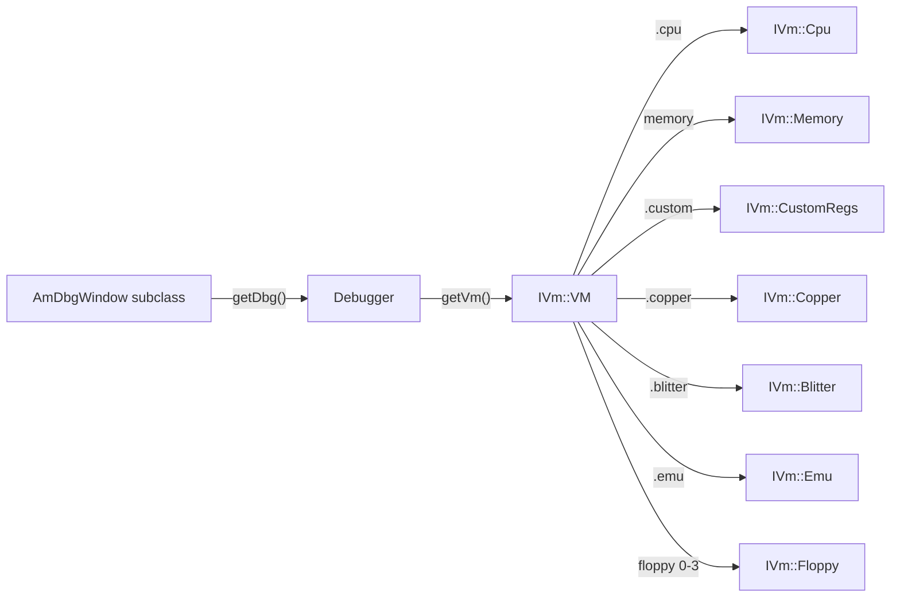

**Implementation chain** (example from `RegistersView::drawContentImp()`):

```cpp
Debugger* dbg = getDbg();         // returns Desktop->m_pDbg
IVm::VM* vm = dbg->getVm();      // returns m_pVm (the UaeVmImp)
IVm::Cpu* cpu = vm->cpu;         // UaeVmImp::Cpu*
cpu->getRegA(i);                 // reads UAE regs.regs[8+i]
cpu->getRegD(i);                 // reads UAE regs.regs[i]
cpu->getPC();                    // reads UAE regs.pc
```

---


## 6. Operation Dispatch System

The debugger uses a **chain-of-responsibility** pattern for operations. Each `IOperationEnvironment` can handle an operation or pass it to its parent.

### Operation Class Hierarchy

```mermaid
graph TB
    BaseOp["qd::operation::BaseOpArgs<br/>getTypeInfo, clone, cast_"]

    OpsArgs["amD::operation::OperationArgs<br/>empty setup"]

    Reset[VmEmuReset<br/>F12 - Reset Amiga]
    Exec[ExecConsoleCmd<br/>cmd: string]
    Dma[DebugDmaOption<br/>dmaMode: int]
    TraceStart[DebugTraceStart<br/>F12 - enter debug mode]
    TraceCont[DebugTraceContinue<br/>F5 - resume emulation]
    StepIn[DisasmTraceStepInto<br/>F11 - step one instruction]
    StepOut[DisasmTraceStepOut<br/>F10 - step over]
    BpToggle[DisasmToggleBreakpoint<br/>F9 - toggle BP at address]
    CopStep[CopperTraceStep<br/>Shift+F11]
    CopBp[CopperToggleBreakpoint<br/>Shift+F9]
    Turbo[ToggleTurboEmulation<br/>NumLock]
    WaitSL[DebugWaitScanLines<br/>wait N scanlines]
    AlwaysTop[VmPlayerWndAlwaysOnTop<br/>Ctrl+T]

    BaseOp --> OpsArgs
    OpsArgs --> Reset
    OpsArgs --> Exec
    OpsArgs --> Dma
    OpsArgs --> TraceStart
    OpsArgs --> TraceCont
    OpsArgs --> StepIn
    OpsArgs --> StepOut
    OpsArgs --> BpToggle
    OpsArgs --> CopStep
    OpsArgs --> CopBp
    OpsArgs --> Turbo
    OpsArgs --> WaitSL
    OpsArgs --> AlwaysTop
```

### Dispatch Chain

Operations flow through the `IOperationEnvironment` chain from UI to VM:

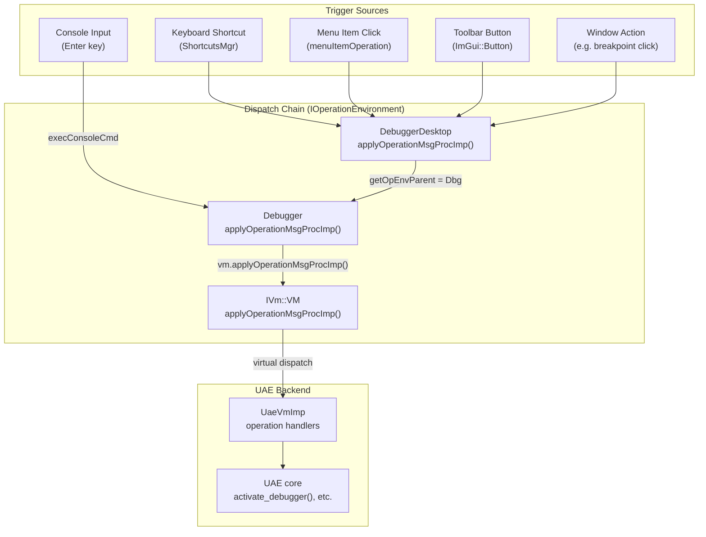

### Dispatch Examples

**Step Into (F11):**
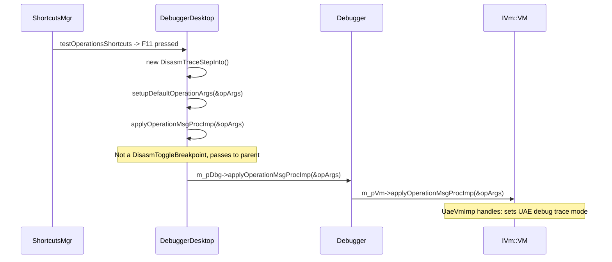

**Toggle Breakpoint (F9):**
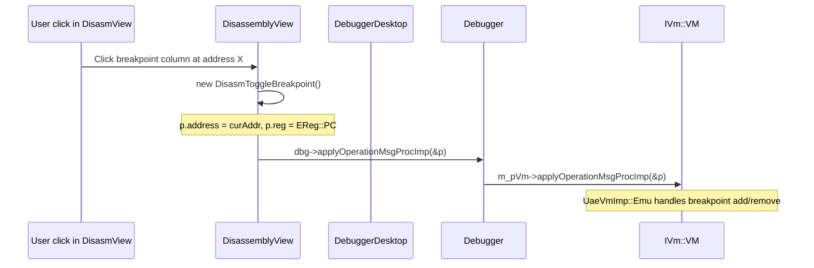

**Source:** [debuggerDesktop.cpp](file:///Volumes/TB4-4Tb/Projects/emulators/github/quaesar-ng/libs/amDebugger/src/amDebugger/ui/debuggerDesktop.cpp) lines 31-41, [debugger.cpp](file:///Volumes/TB4-4Tb/Projects/emulators/github/quaesar-ng/libs/amDebugger/src/amDebugger/debugger.cpp) lines 25-29.

---

## 7. Code Analysis Engine (Disassembly Backend)

The `DisassemblyView` window delegates actual M68K instruction decoding to the `M68CodeDisassembler` singleton, which provides a page-cached disassembly service:

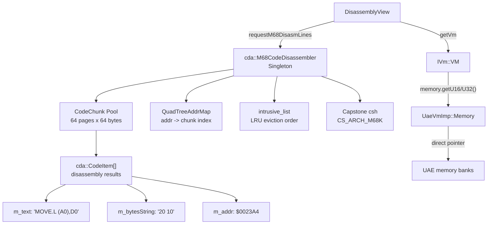

### Disassembly Cache Flow

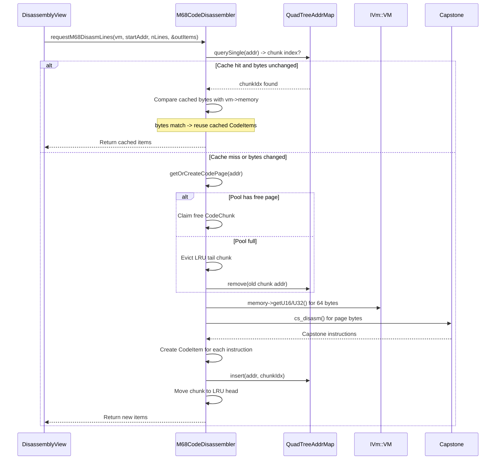

**Source:** [cdaServer.h](file:///Volumes/TB4-4Tb/Projects/emulators/github/quaesar-ng/libs/amDebugger/src/amDebugger/codeAnalyzer/cdaServer.h), [cdaServer.cpp](file:///Volumes/TB4-4Tb/Projects/emulators/github/quaesar-ng/libs/amDebugger/src/amDebugger/codeAnalyzer/cdaServer.cpp).

---


## 8. Menu Bar and Toolbar

### Main Menu Structure

Drawn by `DebuggerDesktop::_drawMainMenuBar()`:

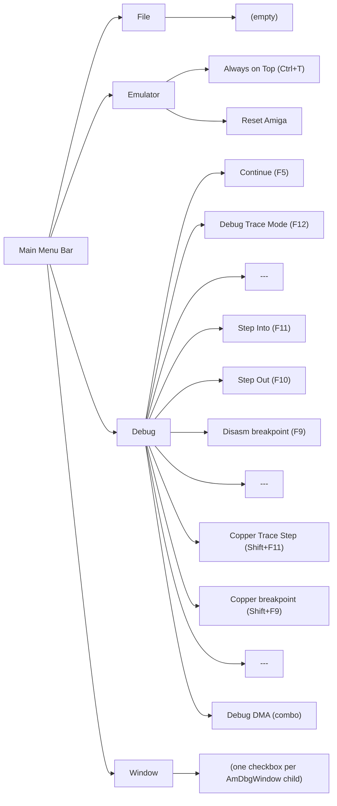

The **Window** menu is dynamically populated by iterating `getChild(i)` for each registered debugger window. Each window's title appears as a checkable menu item toggling its visibility.

**Source:** [debuggerDesktop.cpp](file:///Volumes/TB4-4Tb/Projects/emulators/github/quaesar-ng/libs/amDebugger/src/amDebugger/ui/debuggerDesktop.cpp) lines 50-110.

### Toolbar

Drawn by `DebuggerDesktop::_drawToolBar()` as a horizontal `ImGui::BeginChild("ToolBar")`:

| Widget | Type | Operation | Source |
|--------|------|-----------|--------|
| "Trace" checkbox | `ImGui::Checkbox` | Toggles between `EVmDebugMode::Break` and `Live` | `dbg->setDebugMode()` |
| Step Into button | `ImGui::ImageButton` | `DisasmTraceStepInto` | `doOperation_<>()` |
| Scanlines input | `ImGui::InputInt` | Sets `dbg->setWaitScanLines(n)` | Direct setter |
| "Wait Scanlines" button | `ImGui::Button` | `DebugWaitScanLines` | `doOperation_<>()` |

**Source:** [debuggerDesktop.cpp](file:///Volumes/TB4-4Tb/Projects/emulators/github/quaesar-ng/libs/amDebugger/src/amDebugger/ui/debuggerDesktop.cpp) lines 202-267.

---

## 9. Keyboard Shortcut System

Shortcuts are defined via X-macro in `shortcutsList.h`, which generates both the `amD::shortcut::EId` enum and the `g_shortcuts_list[]` initialization array:

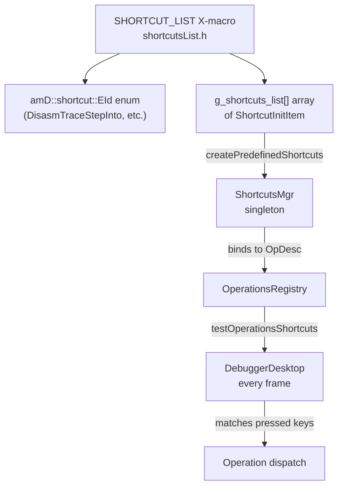

### Complete Shortcut Table

| Shortcut ID | Key Binding | Operation | Context |
|-------------|-------------|-----------|---------|
| `DisasmTraceStepInto` | F11 (repeat) | Step one M68K instruction | Debug menu, toolbar |
| `DisasmTraceStepOut` | F10 (repeat) | Step over instruction | Debug menu |
| `DebugTraceStart` | F12 | Enter debug/break mode | Debug menu |
| `DebugTraceContinue` | F5 | Resume emulation (Live mode) | Debug menu |
| `DisasmToggleBreakpoint` | F9 | Toggle breakpoint at cursor | Debug menu |
| `CopperToggleBreakpoint` | Shift+F9 (repeat) | Toggle copper breakpoint | Debug menu |
| `CopperTraceStep` | Shift+F11 (repeat) | Step copper instruction | Debug menu |
| `ToggleTurboEmulation` | NumLock | Toggle turbo CPU speed | (no menu) |
| `ResetAmigaEmu` | (none) | Reset Amiga | Emulator menu |
| `AlwaysOnTopEmu` | Ctrl+T | Emulator window always-on-top | Emulator menu |
| `ShowDebuggerWnd` | Shift+F12 | Show/hide debugger window | App level |
| `ShowUaeOptionsWnd` | Ctrl+P | Open UAE options dialog | App level |

**Source:** [shortcutsList.h](file:///Volumes/TB4-4Tb/Projects/emulators/github/quaesar-ng/libs/amDebugger/src/amDebugger/shortcutsList.h).

---

## 10. Expression Evaluator Bridge

Several windows (`DisassemblyView`, `MemoryHexViewWnd`, `MemoryGraphWnd`) accept **expression-based address input** through the `ExprValStr` bridge:

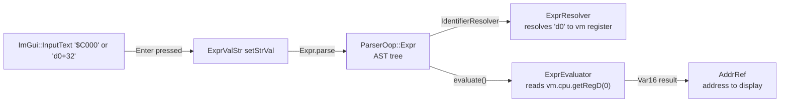

**Source:** [exprValue.h](file:///Volumes/TB4-4Tb/Projects/emulators/github/quaesar-ng/libs/amDebugger/src/amDebugger/exprValue.h), [exprValue.cpp](file:///Volumes/TB4-4Tb/Projects/emulators/github/quaesar-ng/libs/amDebugger/src/amDebugger/exprValue.cpp), [parser_oop.h](file:///Volumes/TB4-4Tb/Projects/emulators/github/quaesar-ng/libs/exprParser/parser/parser_oop.h), [resolve_oop.h](file:///Volumes/TB4-4Tb/Projects/emulators/github/quaesar-ng/libs/exprParser/parser/resolve_oop.h).

---

## 11. Color Theme System

All debugger window colors are managed by the `UiStyle` singleton, which uses an X-macro to define a named color palette:

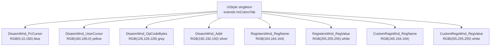

Windows access colors via the free functions `uiGetColorU(id)` (returns `qd::Color`) and `uiGetColorF(id)` (returns `ImVec4`), used in `ImGui::TextColored()`, `ImGui::PushStyleColor()`, and `ImGui::TableSetBgColor()`.

**Source:** [uiStyle.h](file:///Volumes/TB4-4Tb/Projects/emulators/github/quaesar-ng/libs/amDebugger/src/amDebugger/ui/uiStyle.h).

---

## 12. Threading Model

The debugger UI and the emulator run on **separate threads** with mutex-protected data exchange:

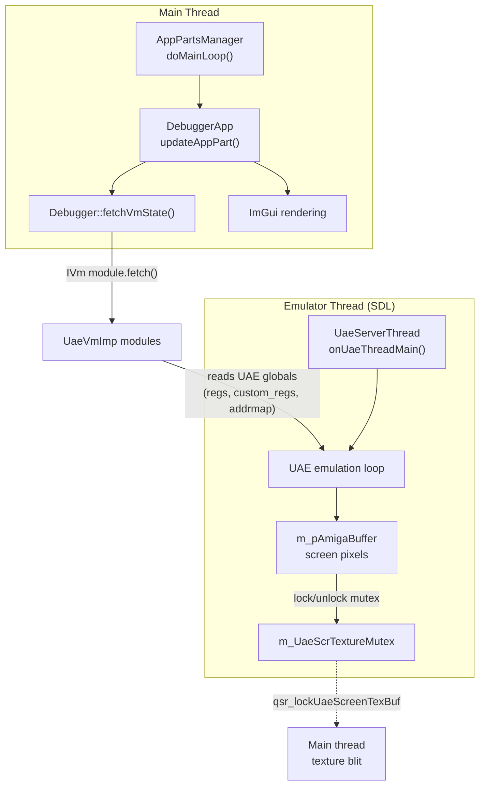

Key insight: `Debugger::fetchVmState()` reads UAE globals (like `regs`, `custom_regs`) **without a mutex**. This works because:
1. The UAE globals are read atomically (single 32-bit values)
2. The debugger reads snapshots that may be slightly stale
3. The emulator thread runs continuously; the debugger just samples state

Screen buffer exchange **does** use `m_UaeScrTextureMutex` because the pixel buffer is large and requires coordinated access.

**Source:** [uae_server_thread.h](file:///Volumes/TB4-4Tb/Projects/emulators/github/quaesar-ng/src/quasar_app/uae_imp/uae_server_thread.h), [uae_server_thread.cpp](file:///Volumes/TB4-4Tb/Projects/emulators/github/quaesar-ng/src/quasar_app/uae_imp/uae_server_thread.cpp).

---

## 13. Complete Data Flow Summary

End-to-end trace from user action to emulator state change:

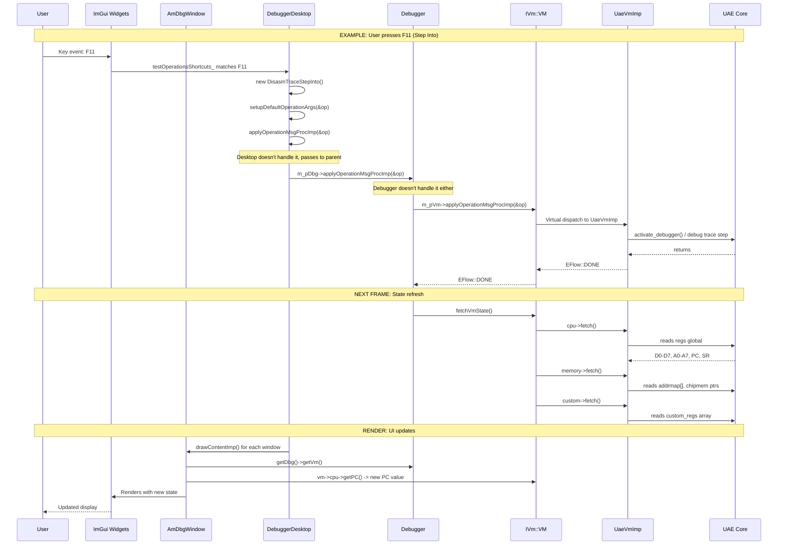
